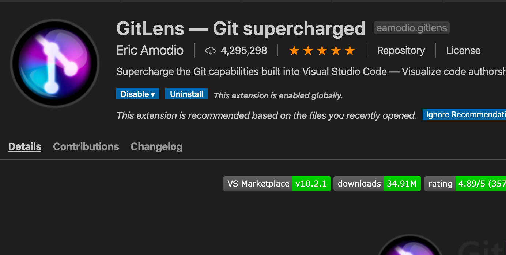

# Angular Template

## Description

This is an Angular template on Docker. The .devcontainer folder contains the configuration so that VSCode can auto-start the container for development.

In order to include VSCode extensions, first find the extension name from the extension's page (i.e. eamodio.gitlens):



Then add the extension name to <a href=".devcontainer/devcontainer.json">devcontainer.json</a> file.

## Getting Started

* Create a new repo and get the git clone URL for that new repo.
* Change the remote URL to new repo.

```
# Check the current remote URL
git remote -v
# Set remote to new URL
git remote set-url origin <https or ssl-url>
```

## Starting With Angular

```
ng new sampleapp
cd sampleapp
# Start rails server
rails s --binding=0.0.0.0
```